# AWS E-Commerce Infrastructure Project

This project demonstrates a complete cloud infrastructure built on AWS to support a small e-commerce application.

The objective was to design and deploy a secure, segmented cloud environment using core AWS services, following best practices for network isolation, database management, and object storage.

---

# Architecture Overview

The infrastructure is organized into a custom VPC with public and private subnets, separating the web layer from the application and data layers.

Architecture diagram:

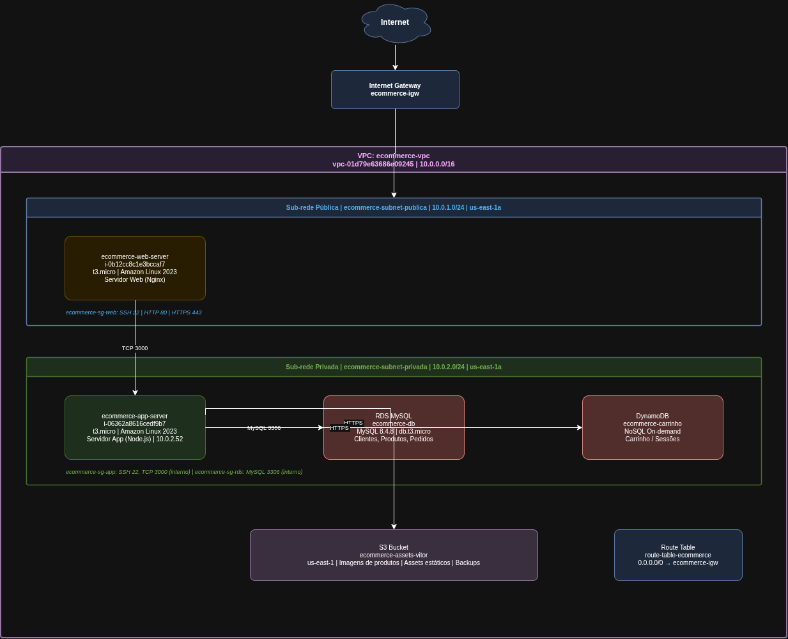

---

# AWS Services Used

This project uses the following AWS services:

- Amazon VPC (custom network with public and private subnets)
- Amazon EC2 (web server and application server)
- Amazon RDS (MySQL relational database)
- Amazon DynamoDB (NoSQL database)
- Amazon S3 (object storage)
- Security Groups (network access control)
- Internet Gateway and Route Tables (public internet access)

---

# Architecture Flow

The request flow works as follows:

1. A user sends a request from the internet
2. The Internet Gateway receives the request and routes it to the public subnet
3. The EC2 web server (Nginx) handles the request
4. The web server forwards it to the EC2 application server (Node.js) in the private subnet
5. The application server reads/writes data to RDS MySQL and DynamoDB
6. Static assets and product images are served from S3

```
Internet
│
▼
Internet Gateway (ecommerce-igw)
│
▼
[Public Subnet 10.0.1.0/24]
EC2 Web Server — Nginx (ecommerce-web-server)
│
▼
[Private Subnet 10.0.2.0/24]
EC2 App Server — Node.js (ecommerce-app-server)
│
├── RDS MySQL (ecommerce-db) — orders, customers, products
└── DynamoDB (ecommerce-carrinho) — shopping cart, sessions

S3 Bucket (ecommerce-assets-vitor) — product images, static files, backups
```

---

# Network Configuration

A custom VPC was created to isolate the entire infrastructure.

**VPC:** `ecommerce-vpc` | `10.0.0.0/16` | `vpc-01d79e63686e09245`

| Subnet | Type | CIDR | Availability Zone |
|---|---|---|---|
| ecommerce-subnet-publica | Public | 10.0.1.0/24 | us-east-1a |
| ecommerce-subnet-privada | Private | 10.0.2.0/24 | us-east-1a |

An Internet Gateway was attached to the VPC and a custom Route Table was configured to route public traffic through it.

Screenshots:

VPC configuration:

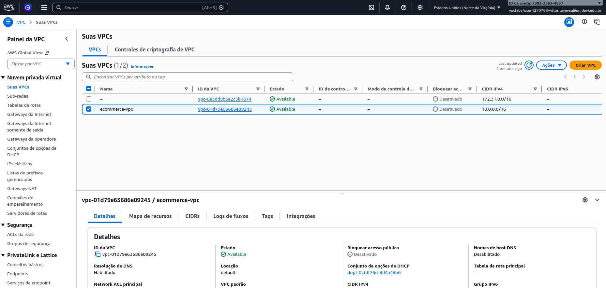

Subnets created:

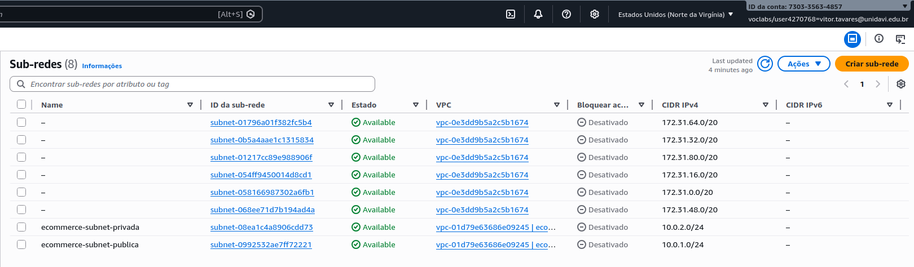

Connectivity test between subnets:

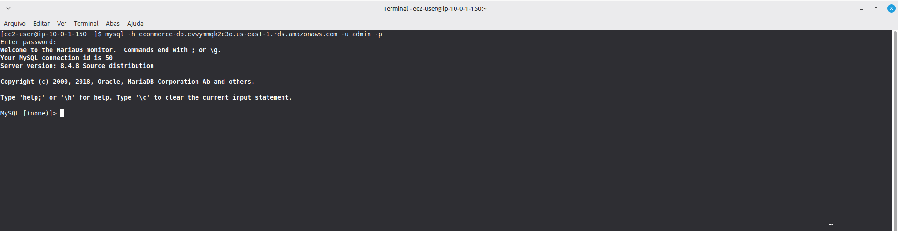

---

# EC2 Instances

Two EC2 instances were deployed with different roles:

**Web Server** — public subnet, accessible from the internet via HTTP/HTTPS.

**Application Server** — private subnet, no public IP, accessible only from within the VPC.

| Instance | ID | Type | OS | Subnet |
|---|---|---|---|---|
| ecommerce-web-server | i-0b12cc8c1e3bccaf7 | t3.micro | Amazon Linux 2023 | Public |
| ecommerce-app-server | i-06362a8616cedf9b7 | t3.micro | Amazon Linux 2023 | Private |

Screenshots:

EC2 instances running:

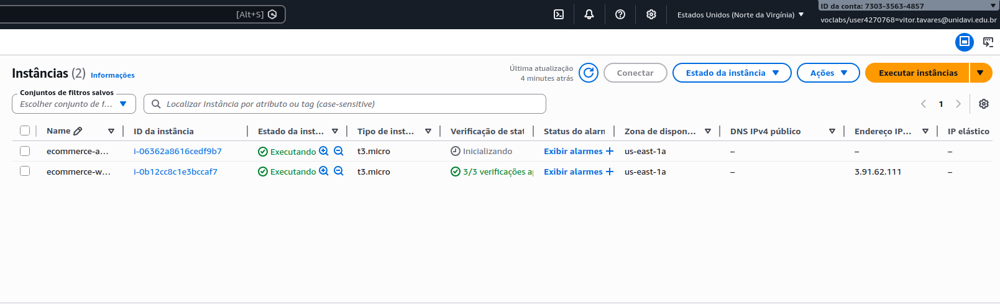

Web server details:

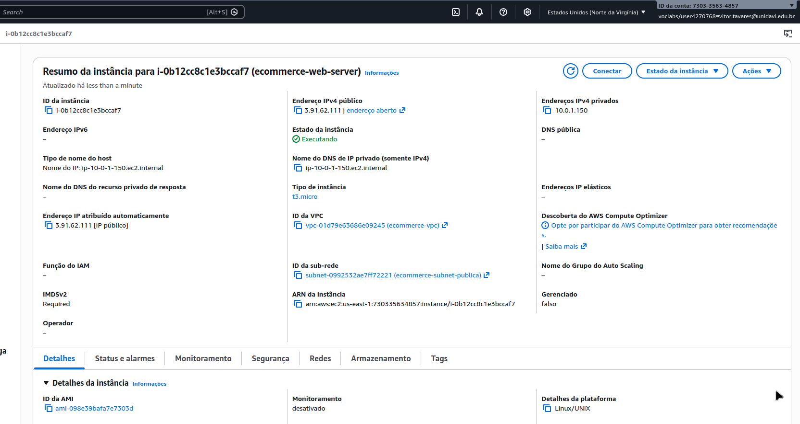

App server details:

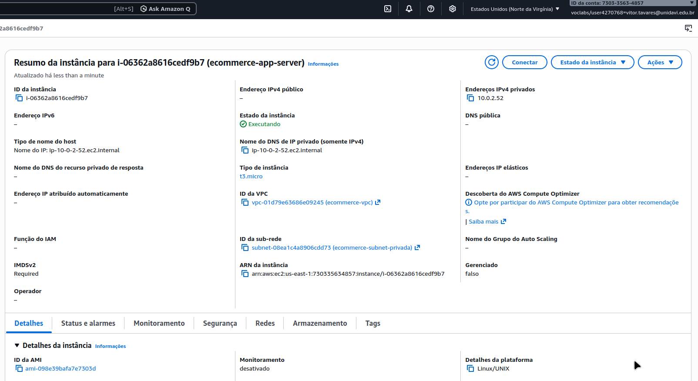

---

# Object Storage

An S3 bucket was created to store static assets for the e-commerce application.

**Bucket:** `ecommerce-assets-vitor` | Region: `us-east-1`

Folders created:

- `produtos/` — product images
- `banners/` — promotional banners
- `backups/` — database backups

Read access is public via bucket policy. Write access is private.

Screenshots:

Bucket configuration:

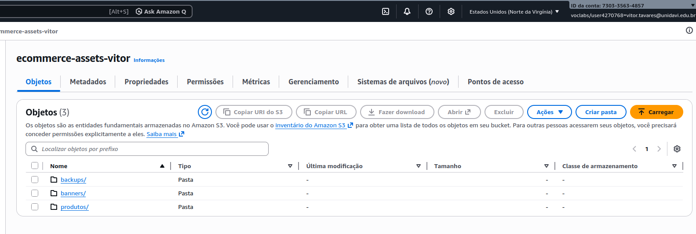

Public access test:

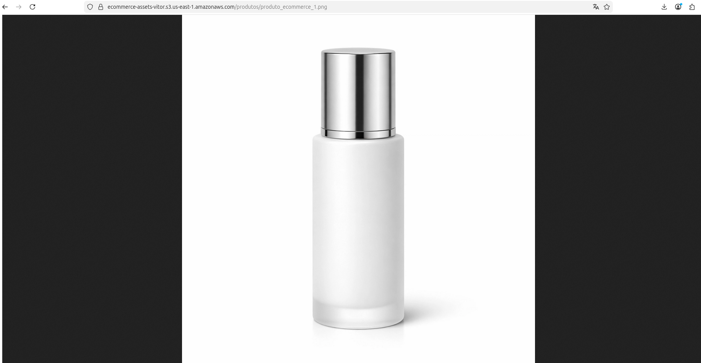

---

# Relational Database — RDS MySQL

An RDS MySQL instance was deployed in the private subnet to store transactional data.

**Instance:** `ecommerce-db` | MySQL 8.4.8 | `db.t3.micro` | 20 GB gp2

The database is not publicly accessible. Connection is only allowed from within the VPC via the `ecommerce-sg-rds` security group.

Tables created and populated with example data:

```sql
-- Customers
CREATE TABLE clientes (
  id INT AUTO_INCREMENT PRIMARY KEY,
  nome VARCHAR(100) NOT NULL,
  email VARCHAR(100) UNIQUE NOT NULL,
  telefone VARCHAR(20),
  criado_em TIMESTAMP DEFAULT CURRENT_TIMESTAMP
);

-- Products
CREATE TABLE produtos (
  id INT AUTO_INCREMENT PRIMARY KEY,
  nome VARCHAR(100) NOT NULL,
  descricao TEXT,
  preco DECIMAL(10,2) NOT NULL,
  estoque INT DEFAULT 0
);

-- Orders
CREATE TABLE pedidos (
  id INT AUTO_INCREMENT PRIMARY KEY,
  cliente_id INT,
  total DECIMAL(10,2),
  status VARCHAR(20) DEFAULT 'pendente',
  criado_em TIMESTAMP DEFAULT CURRENT_TIMESTAMP,
  FOREIGN KEY (cliente_id) REFERENCES clientes(id)
);
```

Screenshots:

RDS configuration:

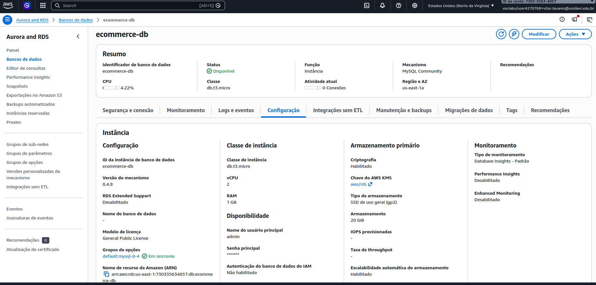

Tables populated with example data:

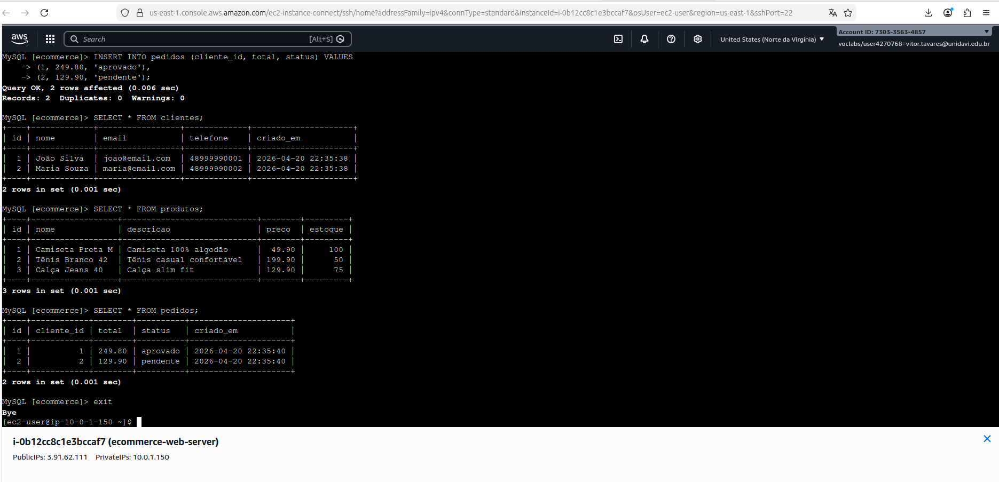

---

# NoSQL Database — DynamoDB

A DynamoDB table was created to store shopping cart and session data, which has flexible structure and requires high read/write performance.

**Table:** `ecommerce-carrinho` | On-demand capacity mode

| Key | Type |
|---|---|
| Partition Key | session_id (String) |
| Sort Key | produto_id (String) |

Example item stored:

```json
{
  "session_id": "sess-001",
  "produto_id": "prod-101",
  "nome_produto": "Camiseta Preta M",
  "quantidade": 2,
  "preco_unitario": 49.90,
  "adicionado_em": "2026-04-20T10:00:00"
}
```

Screenshots:

DynamoDB table configuration:

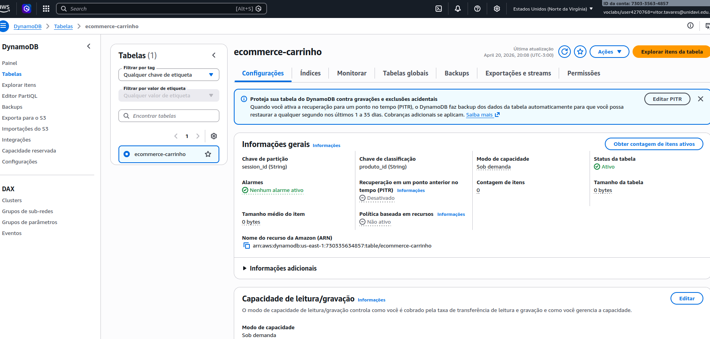

Items inserted:

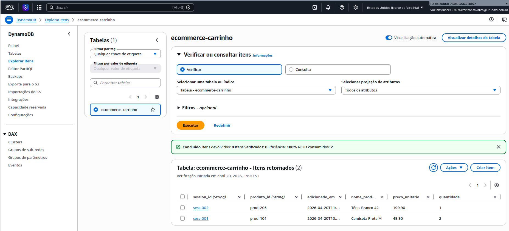

---

# Security

Network access is controlled through Security Groups assigned to each resource:

| Security Group | Resource | Inbound Rules |
|---|---|---|
| ecommerce-sg-web | EC2 Web Server | SSH 22, HTTP 80, HTTPS 443 |
| ecommerce-sg-app | EC2 App Server | SSH 22 (from sg-web), TCP 3000 (from sg-web) |
| ecommerce-sg-rds | RDS MySQL | MySQL 3306 (from sg-web) |

Authentication:

- EC2 instances accessed via RSA private key (`ecommerce-key.pem`)
- RDS accessed via username/password — no public access
- S3 write access restricted via bucket policy

Screenshots:

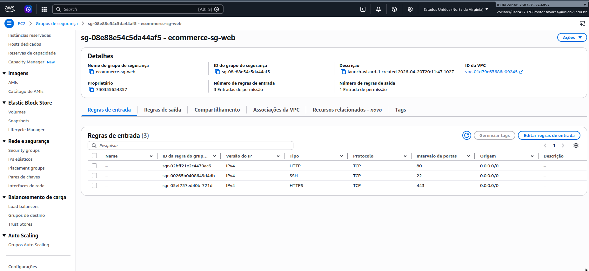

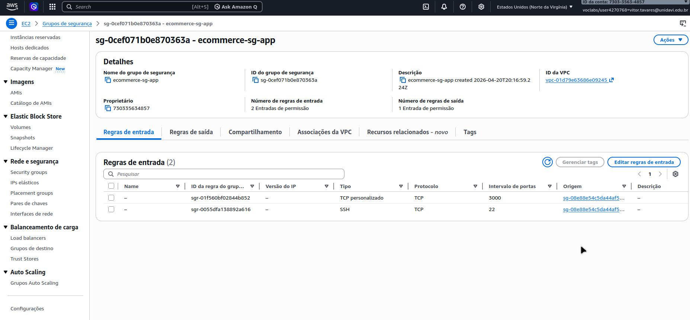

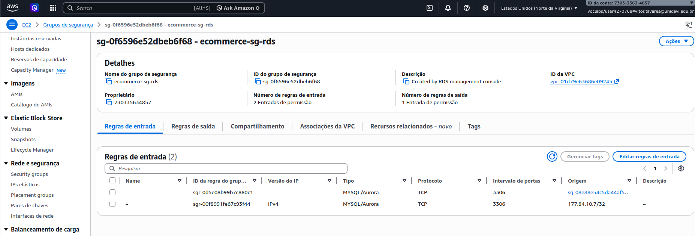

---

# Project Structure

```
ecommerce-aws/
├── README.md
├── docs/
│   └── Vitor_Hugo_Tavares_Trabalho01_Cloud.docx
├── diagrama/
│   └── ecommerce-aws-diagrama.drawio
└── prints/
    ├── vpc-criada.png
    ├── sub-redes.png
    ├── internet-gateway.png
    ├── teste-conectividade.png
    ├── ec2-instancias.png
    ├── ec2-web-server-detalhes.png
    ├── ec2-app-server-detalhes.png
    ├── s3-bucket.png
    ├── teste-de-acesso-ao-bucket-s3.png
    ├── rds-config.png
    ├── rds-dados.png
    ├── dynamodb-config.png
    ├── dynamodb-itens.png
    ├── ecommerce-sg-web-security-group.png
    ├── ecommerce-sg-app-security-group.png
    └── ecommerce-sg-rds-security-group.png
```

---

# Key Cloud Concepts Demonstrated

- Custom VPC design with public and private subnet isolation
- EC2 instance deployment across different network tiers
- Relational and NoSQL database provisioning and management
- Object storage configuration with access control policies
- Security Group rules for layered network access control
- SSH key-based authentication for EC2 instances
- Private database access without public exposure

---

# Author

Vitor Hugo Tavares
